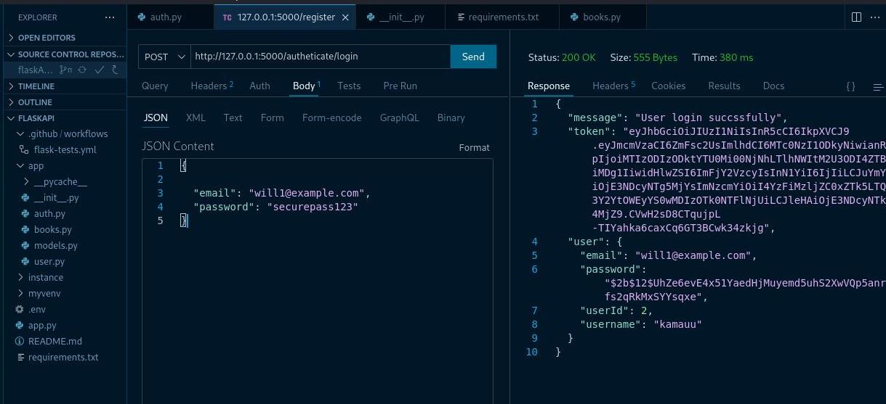

# 🚰🧪 Flask REST API

This is a RESTful API built with Flask that allows users to register, log in, and manage their personal items.

## 🔧 Features

- 🔐 JWT Authentication
- 👤 User Registration and Login
- 📝 Create, Read, Update, Delete (CRUD) for user-specific items
- 🔒 Route protection for authenticated users
- ⚙️ GitHub Actions CI for testing

## 🚀 Technologies

- Python 3
- Flask
- Flask-JWT-Extended
- SQLAlchemy
- SQLite (can switch to PostgreSQL/MySQL)
- GitHub Actions

## 📸 Screenshot



## 📡 API Endpoints

```http
POST /register         # Register a new user
POST /login            # Login and get JWT token
GET /myitems           # Get items for the logged-in user
POST /items            # Add new item (auth required)
PUT /items/<id>        # Update an item (auth required)
DELETE /items/<id>     # Delete an item (auth required)

# Clone the repository
git clone https://github.com/samrato/flaskPi.git
cd flaskPi

# Create and activate virtual environment
python -m venv venv
source venv/bin/activate  # On Windows: venv\Scripts\activate

# Install dependencies
pip install -r requirements.txt

# Run the Flask app
app run
